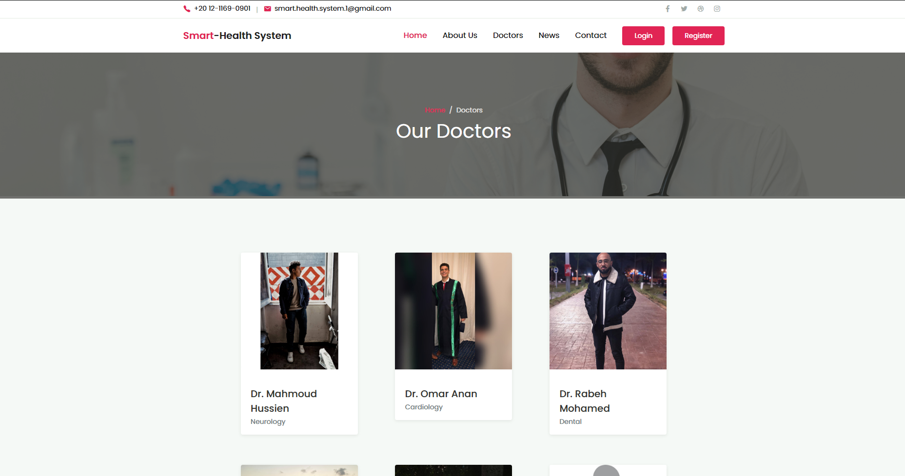
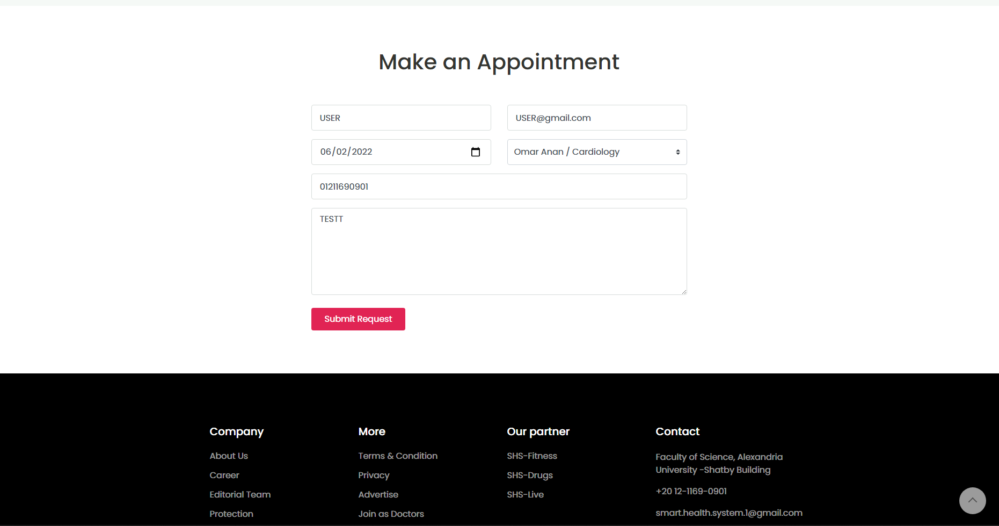
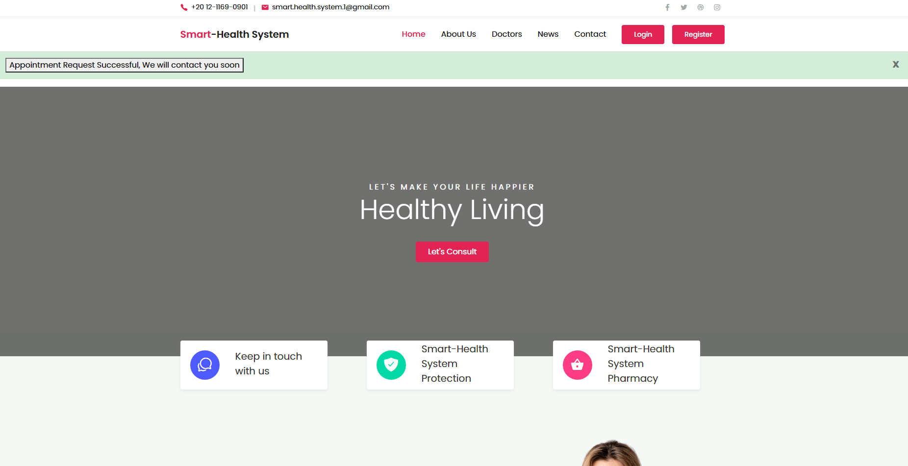
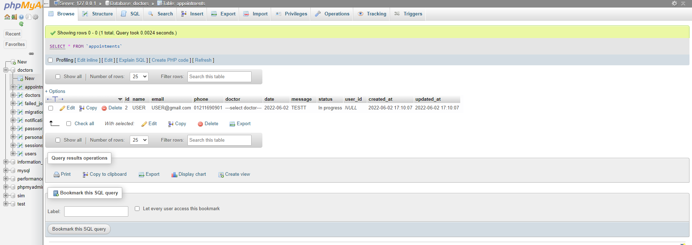
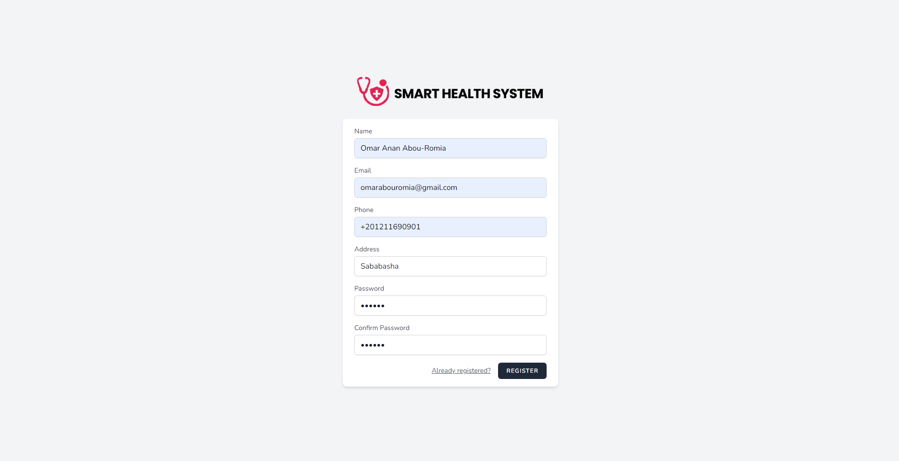
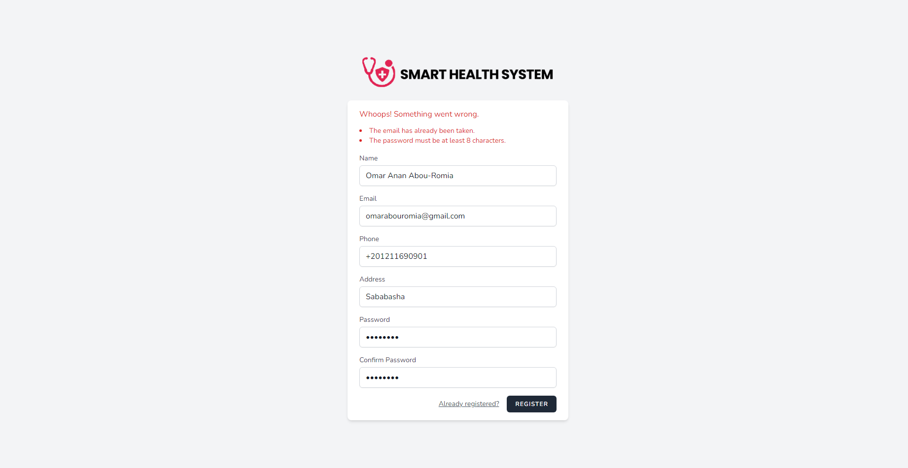
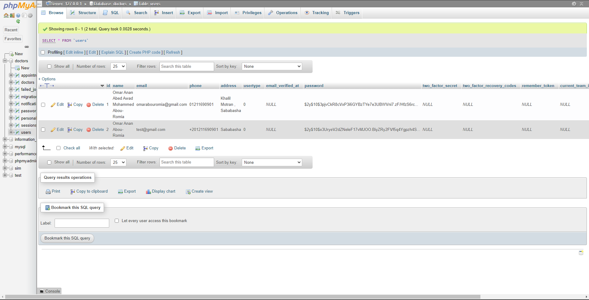

# SmartHealthSystem
  Implemented the Website using Laravel as backend framework for this project to help the people book an appointment with their doctors
<h2>Home Page</h2>

<h2>Make an appointment</h2>

<h2>Your appointment is successfully submitted</h2>

<h2>Your answers in Databse</h2>

<h2>Registration Page</h2>

<h2>Authentication of your account</h2>

<h2>Your Information in the Datbase</h2>

